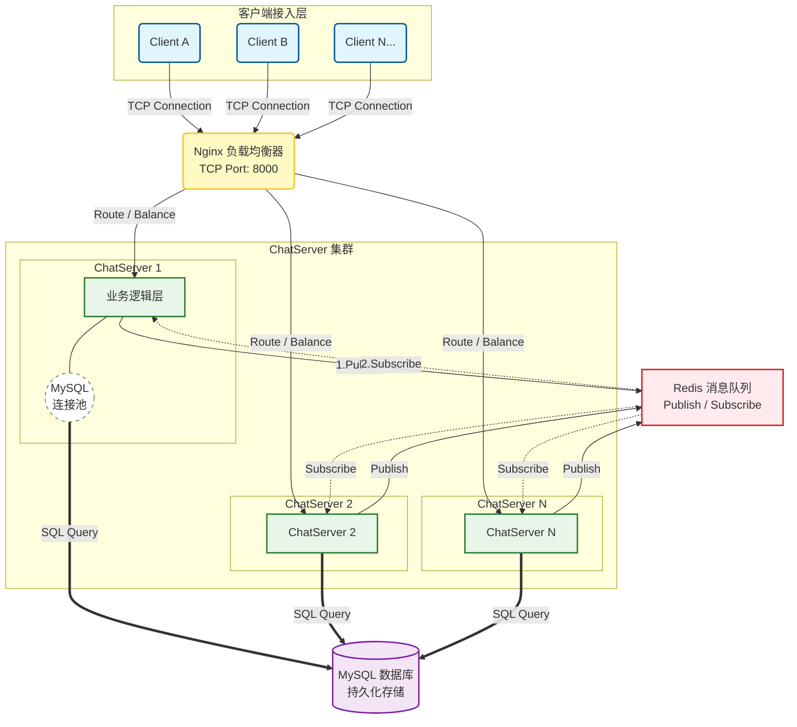

# MyChat

一个聊天服务器项目，可用工作在 nginx tcp 负载均衡环境中，基于 muduo 库实现的集群聊天服务器和客户端源码。


## 核心技术架构：

- 🚀 **网络通信**：使用 **Muduo** 高性能网络库，基于非阻塞 I/O 和事件驱动模型。
- 🔄 **集群通信**：引入 **Redis** 消息队列（Publish/Subscribe 机制），解决跨服务器消息路由问题。
- 💾 **数据存储**：手写 **MySQL 数据库连接池**，减少 TCP 握手开销，大幅提升数据读写效率。
- ⚖️ **负载均衡**：部署 **Nginx** 进行 TCP 负载均衡，实现服务节点的水平扩展与高可用。
- 💓 **长连接保活**：基于 **TCP 心跳机制** 动态监测客户端在线状态，定时剔除僵尸连接，释放服务器资源。


## 编译

```
# 在项目顶层目录下:
mkdir build && cd build
cmake ..
make
```


## 运行

```
# 服务器端:在项目顶层目下:
cd bin
./ChatServer 127.0.0.1 6000

# 或者

./ChatServer 127.0.0.1 6002
```

```
# 客户端，进入到bin目录下
./ChatClient 127.0.0.1 8000
```


## 架构图



